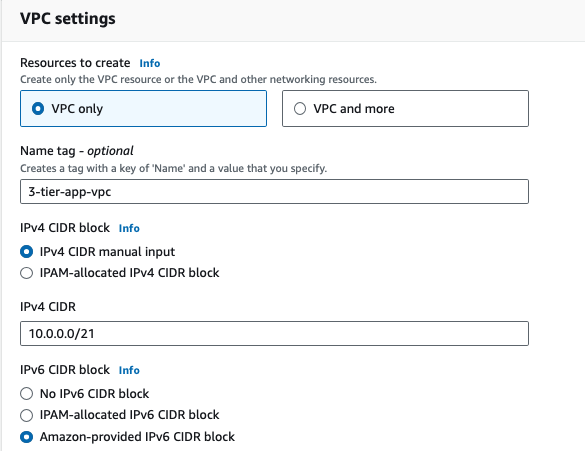

# classic-3-tier-app-on-aws
Classic Three Tier Application running on AWS: Public Tier (Load-Balancer/Proxy), Application Tier, Database Tier

### AWS Featured Resources - VPC, Rout 53, RDS, Application LoadBalancer, EC2

### A Network topology for this App to run is essential.
Create a VPC with a 10.0.0.0/21 IPV4 Cidr Range (2046 IP Addresses) and enable AWS-provided IPv6

Create Subnets Per Tier Per AZ to achieve HA, Fault-Tolerance & Isolation

