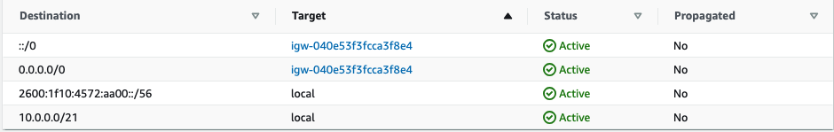

# classic-3-tier-app-on-aws
Classic Three Tier Application running on AWS: Public Tier (Load-Balancer/Proxy), Application Tier, Database Tier

### AWS Featured Resources - VPC, Rout 53, RDS, Application LoadBalancer, EC2

### A Network topology for this App to run is essential.
Create a VPC with a 10.0.0.0/21 IPV4 Cidr Range (2046 IP Addresses) and enable AWS-provided IPv6

Create Subnets Per Tier Per AZ to achieve HA, Fault-Tolerance & Isolation

### Internet Access
By Default, VPCs are private & don't communicate with the outside world. An Internet Gateway(IGW) is required for a VPC to access the Internet & The public subnets that require access to the Internet are explicitly associated with Route Tables which have routes to the IGW

### Create an IGW - Attach to the VPC - then use the IGW as a Target for Routes

### Private Subnets Sometimes need One-way communication to the internet, NAT enables this for IPv4 traffic & Egress-Only Internet Gateway enables this for IPv6 traffic.

### Create NAT in a Public Subnet with an Elastic Public IP Attached

### Egress-Only Internet Gateway - For egress-only traffic for IPv6

### Configure Routing
Routing is only concerned with whether traffic can flow from one place to another. Routing is not concerned with protocols e.g. TCP/UDP/ICMP, nor concerned with ports e.g. 80/443

***All VPCs have a default route table, with default routes & this is referred to as the "Main Route Table" If a Subnet is not explicitly associated with a route table, it is implicitly associated with the main route table***

### Create a Public Route Table & associate it with the Public Subnets

### Enable Auto-assign IPv4/6 addresses on all Public Subnets
Any Machine launched into the Public subnets will automatically receive a public IPv4/6 addresses

### Create a Private Route Table & associate it with the Private Subnets
Create a Route Table that Routes IPV4 traffic to NAT and IPv6 Traffic to Egress-Only Internet Gateway, Explicitly associate the Route Table to the Private Subnets, Machines in these Subnets can reach the internet & receive responses but can't be reached from the Internet.

### Create a Database Route Table & associate it with the Database Subnets
All Traffic remains local in the VPC
