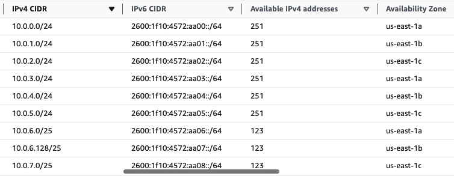
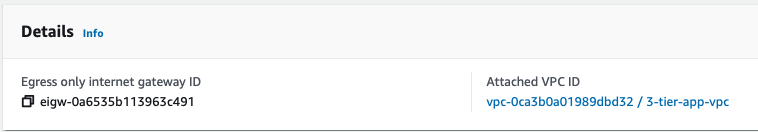
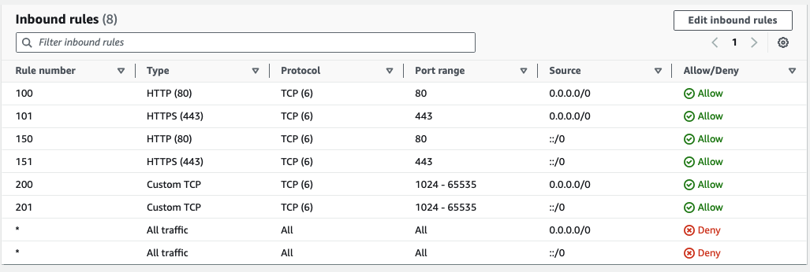
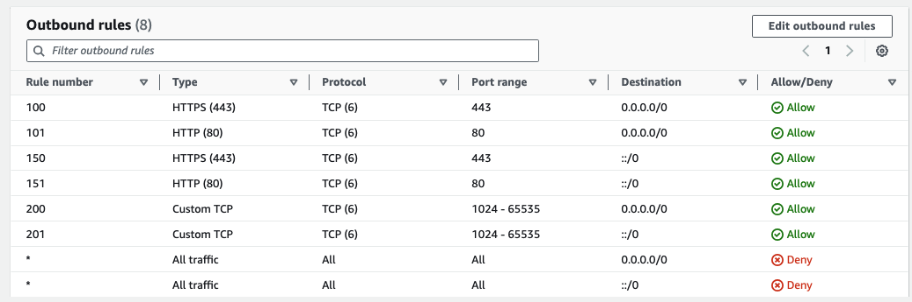
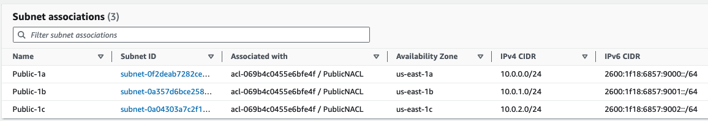

# classic-3-tier-app-on-aws
Classic Three Tier Application running on AWS: Public Tier (Load-Balancer/Proxy), Application Tier, Database Tier

### AWS Featured Resources - VPC, Rout 53, RDS, Application LoadBalancer, EC2

.jpeg)

### A Network topology for this App to run is essential.
Create a VPC with a 10.0.0.0/21 IPV4 Cidr Range (2046 IP Addresses) and enable AWS-provided IPv6


Create Subnets Per Tier Per AZ to achieve HA, Fault-Tolerance & Isolation



### Internet Access
By Default, VPCs are private & don't communicate with the outside world. An Internet Gateway(IGW) is required for a VPC to access the Internet & The public subnets that require access to the Internet are explicitly associated with Route Tables which have routes to the IGW

### Create an IGW - Attach to the VPC - then use the IGW as a Target for Routes


### Private Subnets Sometimes need One-way communication to the internet, NAT enables this for IPv4 traffic & Egress-Only Internet Gateway enables this for IPv6 traffic.

### Create NAT in a Public Subnet with an Elastic Public IP Attached


### Egress-Only Internet Gateway - For egress-only traffic for IPv6




### Configure Routing
Routing is only concerned with whether traffic can flow from one place to another. Routing is not concerned with protocols e.g. TCP/UDP/ICMP, nor concerned with ports e.g. 80/443

***All VPCs have a default route table, with default routes & this is referred to as the "Main Route Table" If a Subnet is not explicitly associated with a route table, it is implicitly associated with the main route table***


### Create a Public Route Table & associate it with the Public Subnets


### Enable Auto-assign IPv4/6 addresses on all Public Subnets
Any Machine launched into the Public subnets will automatically receive a public IPv4/6 addresses


### Create a Private Route Table & associate it with the Private Subnets
Create a Route Table that Routes IPV4 traffic to NAT and IPv6 Traffic to Egress-Only Internet Gateway, Explicitly associate the Route Table to the Private Subnets, Machines in these Subnets can reach the internet & receive responses but can't be reached from the Internet.


### Create a Database Route Table & associate it with the Database Subnets
All Traffic remains local in the VPC


### Subnet & Instance Level Security - NACLs & Security Groups
***NACLs (Firewalls for the entire subnet) - Applied to the entire subnet, for packets to reach our EC2 instances they have to be explicitly allowed by the NACL, then further filtered by the Security Groups at the instance level.***

NACLs are Stateless - they don’t remember TCP sessions, they don’t recognize a response as being a response to a request that came in earlier, so ingress & egress rules must be specified. Default NACLS allows all * traffic. You can also create Allow or Deny rules, Specify the Protocol, Source/destination IP range, and the Source/destination Port range

### Create three different NACLs, one for the private subnet & the other for the Public Subnet & Database Subnet
By Default all ingress & egress traffic to newly created NACLs are denied, we have to explicitly create allow rules

### Create Public Subnet NACL rules:
Allow IPv4/6 ingress traffic on Port 80 & 443 from the internet (0.0.0.0/0 & ::/0)
Allow ephemeral Ports 1024-65535 in, so that NAT instance in the Public Subnet can receive IPv4 response to request it sent out

### Inbound Public NACL rules



### Outbound Public NACL rules
Ephemeral Ports 1024-65535 (egress) have to be opened for IPV4/6 - 0.0.0.0/0 & ::/0, so the response can be sent to the end-users
Open Port 80/443 so the NAT can send outbound IPv4 traffic - 0.0.0.0/0





### Create Private Subnet NACL rules:


### Inbound Private NACL rules

In order for EC2 instances to receive traffic from the Database Subnet you need to open ingress ephemeral Ports 1024-65535 for IPv4/6 traffic - 0.0.0.0/0, ::/0
Also, allow inbound IPv4/6 traffic on ports 443 and 80


### Outbound Private NACL rules
In order to send traffic to the Database Subnet Allow outbound traffic on Port 5432 for IPv4/6


### Create Database NACL rules 

### Inbound Database NACL rules
Allow Ingress traffic on port 5432 for IPv4/6 VPC traffic, so EC2 instances in the Private Subnet can communicate to the database
Also, allow IPv4/6 traffic on ephemeral ports 1024 - 65535 to receive responses from the WebServer


### Outbound Database NACL rules
In order for the database to send responses ephemeral Ports 1024-65535 need to be opened outbound for Ipv4/6 traffic


### Security Groups - are applied directly to the instances, security groups are stateful, they do recognize sessions
We can specify just ingress rules, you can only specify allow rules, no deny rules, all inbound traffic is denied by default and all outbound is allowed. Specify Protocol and source IP/Port range

### Create Three Security Groups - DatabaseSG, WebServerSG, AlbSG

### AlbSG
Allow inbound TCP on Port 80/443 from the Internet - 0.0.0.0/0 & ::/0
Allow outbound ephemeral Ports 1024-65535 to the WebServer Security Group
Hardwire this load balancer to only communicate with the WebServers Security Group

### Inbound ALB Security Group Rules


### Outbound ALB Security Group Rules


### WebServerSG
Allow traffic from ephemeral Ports 1024 - 65535 for IPv4/6

### Inbound WebServer Security Group Rules


### Outbound WebServer Security Group Rules


### DatabaseSG
Allow inbound traffic on port 5432 from only the WebserverSG (Using security group references) and on ephemeral ports 1024-65535

### Inbound Database Security Group Rules


### Outbound Database Security Group Rules


## Create RDS (Postgres)
Create an RDS Postgres Database in the Database Subnet, running in a private subnet, only accessible by the WebServer.


### Create EC2 instances with User Data configured to install & run Httpd server at boot time 
Connect to the RDS & also show information about the Instance on the webpage and attach an EC2 instance role, allowing readOnly permission to RDS
The UserData Script to perform this task is shown below:

```bash
#!/bin/bash
sudo yum update
sudo yum install nc -y
sudo yum install -y httpd
sudo systemctl start httpd
sudo systemctl enable httpd

RDS_EC2_ROLE=$(aws rds describe-db-instances --output text)

nc -zv database-1.cdsskywd9sbc.us-east-1.rds.amazonaws.com 5432 > file.txt 2>&1
RDS_CONNECTION=$(cat file.txt)

sudo cat > ~/index.html << EOF
<h1>We are Live from $(hostname -f)  Testing EC2_ROLE:  $RDS_EC2_ROLE  Testing RDS_CONNECTION: $RDS_CONNECTION</h1> 
EOF

sudo mv ~/index.html /var/www/html
sudo systemctl reload httpd.service  

```


### Create an ALB to route external traffic to the EC2 instance
The Webserver Should serve as a target group for the ALB


### Route53
Create an Alias record to resolve traffic to the ALB

### Create a Certificate manager to encrypt traffic from the internet to the Route 53 record


